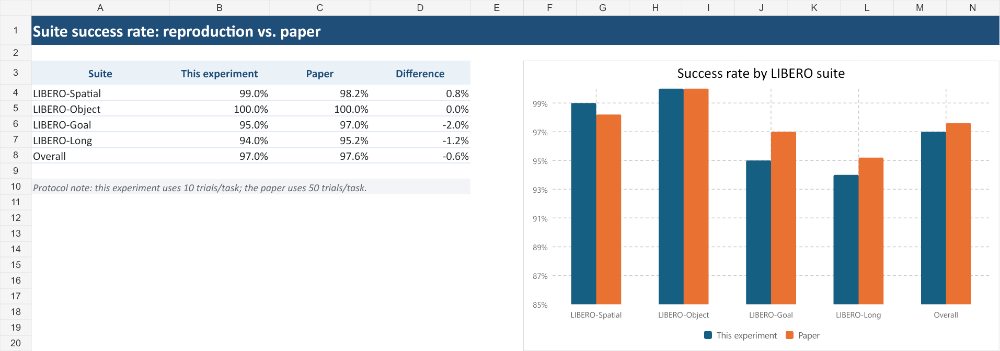
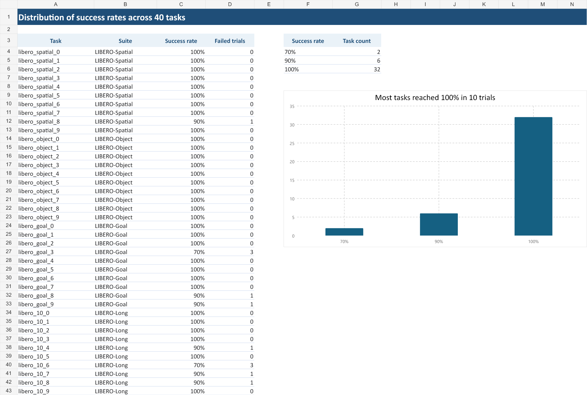
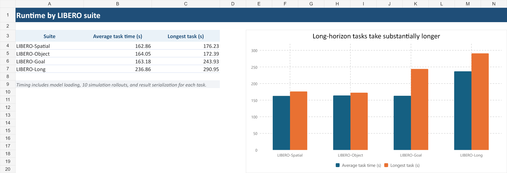

# FastWAM：LIBERO 单卡复现记录

> 本文记录本人基于 FastWAM 官方代码与官方发布权重完成的 LIBERO 推理评测复现。项目定位是“官方模型评测复现与单卡兼容性整理”，不将其表述为从零训练模型。

## 1. 复现结论

在一张 NVIDIA GeForce RTX 5090（32 GB）上，使用官方 `libero_uncond_2cam224.pt` 权重，对 LIBERO 四个任务套件的 40 个任务分别运行 10 次，共完成 400 次 rollout。

| 任务套件 | 成功次数 | 总次数 | 成功率 |
|---|---:|---:|---:|
| LIBERO-Spatial | 99 | 100 | 99.0% |
| LIBERO-Object | 100 | 100 | 100.0% |
| LIBERO-Goal | 95 | 100 | 95.0% |
| LIBERO-Long（libero_10） | 94 | 100 | 94.0% |
| **总体** | **388** | **400** | **97.0%** |

本次实测总体成功率为 97.0%，与论文报告的 97.6% 相差 0.6 个百分点。



## 2. 任务级结果

40 个任务中：

- 34 个任务达到 10/10；
- 4 个任务达到 9/10；
- 2 个任务达到 7/10；
- 没有任务低于 7/10。



两个最低成功率任务为：

- `libero_goal_3`：7/10，任务描述为打开顶层抽屉并将碗放入；
- `libero_10_6`：7/10，任务包含放置白色杯子与巧克力布丁两个子目标。

结果 JSON 可以证明每次 rollout 的成败，但本次正式评测关闭了视频保存，因此不能仅凭结果文件断言具体失败发生在哪个动作阶段。若要开展失败原因分析，应针对上述任务开启视频并使用固定随机种子重跑。

## 3. 运行时间

完整评测耗时约 7269.53 秒，即 2 小时 1 分 10 秒；平均每个任务约 181.74 秒。



## 4. 实验环境

| 项目 | 配置 |
|---|---|
| 云平台 | AutoDL |
| GPU | NVIDIA GeForce RTX 5090 32 GB，单卡 |
| 操作系统 | Ubuntu 22.04 |
| Python | 3.10.20 |
| PyTorch | 2.7.1+cu128 |
| CUDA runtime | 12.8 |
| Transformers | 4.49.0 |
| FastWAM 基线提交 | `45d8e1458921d83f8ad6cf9ce993d371208dabd0` |
| 官方权重 SHA256 | `1000437cfcf55c000094f79a2600634c502bcb5b492476b94bf8509883a49579` |

## 5. 评测设置

- 四个任务套件：`libero_spatial`、`libero_object`、`libero_goal`、`libero_10`
- 每个套件 10 个任务
- 每个任务 10 次 rollout
- 单 GPU 串行调度，每张卡同时运行 1 个任务
- 正式评测关闭 rollout 视频，以节省磁盘空间
- 使用官方数据统计文件 `libero_uncond_2cam224_dataset_stats.json`

单卡正式评测命令示例：

```bash
python experiments/libero/run_libero_manager.py \
  task=libero_uncond_2cam224_1e-4 \
  ckpt=/root/autodl-tmp/checkpoints/fastwam_release/libero_uncond_2cam224.pt \
  EVALUATION.dataset_stats_path=/root/autodl-tmp/checkpoints/fastwam_release/libero_uncond_2cam224_dataset_stats.json \
  EVALUATION.num_trials=10 \
  EVALUATION.save_rollout_video=false \
  EVALUATION.output_dir=/root/autodl-tmp/evaluate_results/formal_10trials \
  MULTIRUN.task_file=/root/autodl-tmp/cross_suite_tasks.txt \
  MULTIRUN.num_gpus=1 \
  MULTIRUN.max_tasks_per_gpu=1
```

## 6. 单卡复现中完成的代码修改

为使官方多卡评测脚本能够在租用的单卡环境中稳定执行，本分支完成了三项小范围修改：

1. `c82a2a6`：子进程使用与管理器一致的 Python 解释器，并在评测结束时显式关闭环境；
2. `b513469`：保留用户传入的任务列表，避免管理器覆盖自定义 task file；
3. `9777a21`：增加关闭 rollout 视频的配置入口。

这些修改不改变模型结构、权重或成功判定逻辑，主要用于环境兼容、任务调度和结果管理。

## 7. 可核验材料

本次复现保留了：

- 40 个任务结果 JSON；
- 40 份任务运行日志；
- `summary.json`、`summary.csv` 和任务级成功率表；
- 环境与权重校验信息；
- smoke test 成功视频；
- 完整结果归档及 SHA256。

[查看 smoke test 成功视频](docs/assets/reproduction/smoke_success_spatial_task0.mp4)

## 8. 项目边界与下一步

当前阶段已经完成“官方代码部署—环境验证—单任务闭环—四套件正式评测—结果归档”的完整复现链路。下一步适合围绕低成功率任务开展可解释的失败案例分析，并尝试一项范围明确、能够进行前后对照的小改进，而不是直接宣称完成了完整训练复现。
