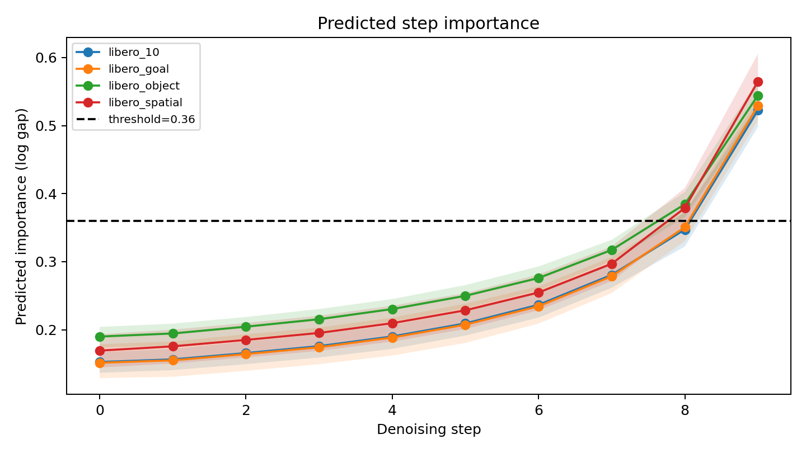
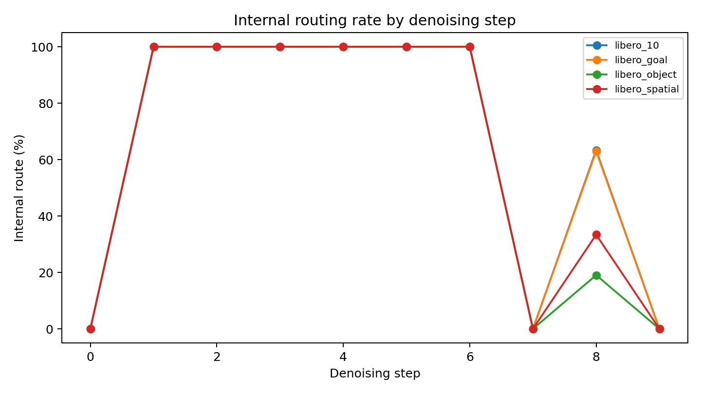
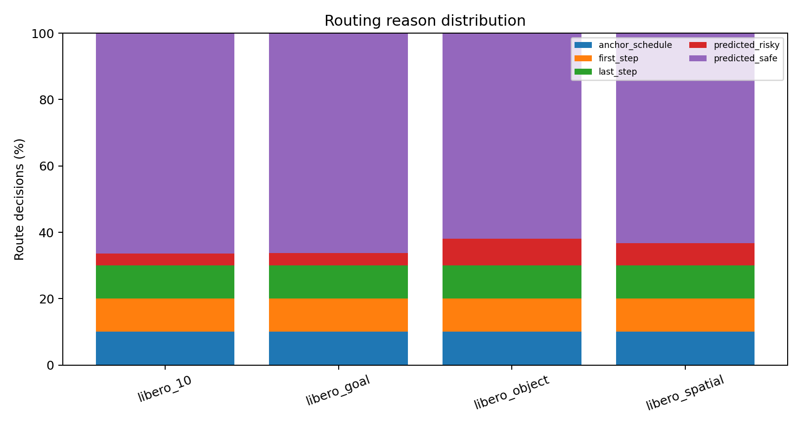
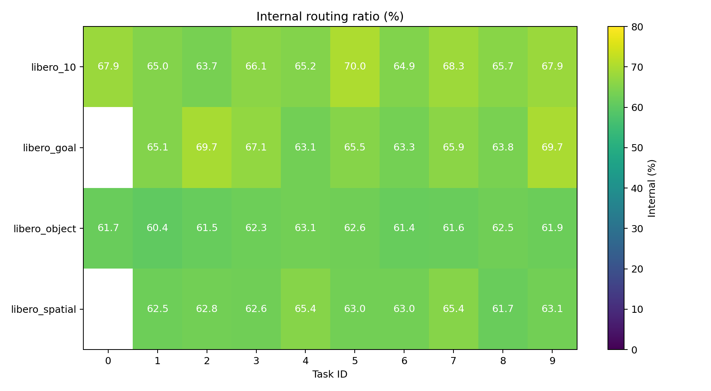

# Dynamic ActionGap：基于中间隐藏状态的动态 Internal/Full 路由

> 阶段性研究报告与论文实验路线图
> 更新日期：2026-08-19
> 当前状态：fork2_b0 已确定为最终 static architecture；t0.40 matched fixed/random 已完成；最低实验闭环结束，停止新增实验并进入写作。
> **阅读提示：本文按时间保留完整实验演进，开头部分包含历史 fork4/v4 结论。当前唯一阶段结论以 `docs/CURRENT_STAGE_SNAPSHOT_ZH.md` 为准。**
> **LingBot-VA 迁移实验单独记录于 `docs/LINGBOT_VA_TRANSFER_REPORT_ZH.md`，本文不混入其不同运行时的绝对耗时。**

## 1. 报告目的

老师提出的核心方向是：不必让每个 action denoising step 都运行到 Action DiT 的最后一层，可以利用中间层 hidden states 预测当前步骤的重要性，并动态决定该步继续走完整分支（full）还是提前走浅层分支（internal）。

本报告用于持续回答以下问题：

1. 不同去噪步骤的重要性是否确实不同？
2. 中间 hidden states 能否预测 internal 相对 full 的动作误差风险？
3. 动态路由能否在基本不降低闭环成功率的前提下提高速度？
4. 收益究竟来自状态相关的 hidden features，还是 MLP 只学到了一张固定 timestep 调度表？
5. 动态路由是否引入动作抖动、重规划跳变或夹爪异常？

因此，本文档既记录已有结果，也作为后续实验、可视化和论文写作的统一框架。

## 2. 历史阶段结论（fork4_b1/v4，已被后续结构实验更新）

截至目前，能够较稳妥地表述的结论是：

- Dynamic ActionGap 已形成从数据采集、MLP 风险预测、在线路由、安全约束到闭环评测的完整流程。
- 在 `libero_goal`、`libero_spatial`、`libero_object` 和 `libero_10` 共 380 个 fixed/dynamic 配对 episode 上，两种方法均成功 `366/380`。
- 相对 fixed gap=4，dynamic 的加权平均 Action denoise 加速约 `1.043x`，`infer_action` 加速约 `1.029x`，internal ratio 从固定 `60.0%` 提高到约 `64.9%`。
- 相对不使用 internal 分支的 full baseline，当前 dynamic 在已统计实验中的 Action denoise 约为 `2.03x`，完整 `infer_action` 约为 `1.70x`。
- 路由比例会随 Suite 变化：Goal/LIBERO-10 更积极，Object/Spatial 更保守。这与“简单状态多复用、风险状态多纠偏”的设计目标一致。
- Meta-only 在 Goal/Spatial task1–9 上取得 `173/180`，不低于 hidden+meta 的 `172/180`；其 internal ratio 在所有任务上均固定为 `70.0%`。当前结果说明 timestep/meta 已经能够形成很强的调度，尚无证据证明 hidden states 带来额外闭环收益。
- 在相同训练任务下，meta-only 的验证 MAE 为 `0.10240`，约为 hidden+meta（`0.01465`）的 7 倍；Smooth L1 也从 `0.0002024` 增至 `0.008336`。这提供了明确的离线证据：hidden state 对预测真实 internal/full action gap 很重要，但该预测优势尚未转化为当前单点路由配置下的闭环优势。
- task9 Goal 的小样本抖动分析中，dynamic 的 jerk 和 replan jump 高于 fixed，且成功率为 `8/10`。这是需要进一步分析的风险信号，暂不能下普遍性结论。

## 3. 方法

### 3.1 问题定义

原始 fixed gap=4 对所有任务和状态使用固定 full/internal 调度，internal ratio 恒为 `60%`。这种调度无法区分：

- 当前视觉与动作状态是否简单；
- 当前 diffusion step 是否敏感；
- internal 输出是否已经足够接近 full 输出；
- 当前是否处于接触、抓取、放置等高风险阶段。

Dynamic ActionGap 将每个 action denoising step 看作一次路由决策：

- 预测风险较低：使用 internal 分支；
- 预测风险较高：运行完整 Action DiT；
- 安全规则强制部分步骤运行 full，防止长时间累积误差。

### 3.2 MLP 输入与训练目标

当前 hidden+meta gate 的输入包括：

- Action DiT 共享浅层 hidden state 的池化特征；
- diffusion timestep；
- 当前 step index；
- 距离上一次 full step 的步数等路由元信息。

监督目标为：

```text
log1p(normalized internal/full action gap)
```

该 gap 衡量同一步骤中 internal action 与 full action 的归一化差异。预测值不高于阈值时走 internal，否则走 full。

hidden+meta gate 当前验证集结果：

| 指标 | 数值 |
|---|---:|
| Smooth L1 | 0.0002024 |
| MAE | 0.01465 |
| 初始验证阈值 | 0.24291 |

### 3.3 历史 fork4 阶段候选配置

当前主候选 `v4_t036`：

```text
threshold = 0.36
max_internal_run = 7
anchor_action_gap = 8
first_step = full
last_step = full
```

其中 first/last step、周期 anchor 和最大连续 internal 次数是安全约束。阈值和约束在 task0 smoke 阶段选定，随后冻结用于 held-out task。

### 3.4 对照方法

| 方法 | 含义 | 当前状态 |
|---|---|---|
| full | 每一步均运行完整 Action DiT | 已测主要速度基线 |
| fixed_gap4 | 固定 ActionGap=4，internal ratio 为 60% | 已完成 |
| v4_t036 | hidden+meta MLP 动态路由 | 已完成主要跨任务评测 |
| meta_only_t036 | 不读取 hidden state，只使用 timestep/meta | smoke 已完成，跨任务评测中 |
| hidden_only | 只读取 hidden state，不使用 timestep/meta | 待补充 |
| compute-matched fixed | 与 dynamic 使用相近 internal ratio 的固定调度 | 待补充 |
| compute-matched random | 与 dynamic 使用相近 internal ratio 的随机路由 | 待补充 |

## 4. 实验协议

- Benchmark：LIBERO Goal、Spatial、Object、LIBERO-10。
- 主模型与 internal LoRA checkpoint 在对比中保持不变。
- fixed 与 dynamic 使用相同 task、initial states 和 episode 数。
- task0 用于 smoke 与候选选择；其余 task 用于冻结参数后的跨任务验证。
- 主要指标：闭环成功率、Action denoise 时间、完整 `infer_action` 时间、internal ratio。
- 安全指标：action delta、delta p95、jerk、replan jump、gripper flips。
- 路由指标：predicted gap、逐 timestep internal rate、route reason、不同 task/Suite 的 internal ratio。

注意：`infer_action` 包括 video prefill 与 Action DiT 等动作推理过程，但不等于完整机器人系统从传感器到执行器的端到端墙钟时间。

## 5. 已有实验结果

### 5.1 task0：40-episode 扩展验证

| Suite | 方法 | 成功率 | Denoise ms | Infer ms | Internal ratio |
|---|---|---:|---:|---:|---:|
| libero_goal | fixed_gap4 | 20/20 | 147.19 | 214.74 | 60.0% |
| libero_goal | v4_t036 | 20/20 | 130.36 | 197.68 | 70.0% |
| libero_spatial | fixed_gap4 | 19/20 | 148.87 | 217.74 | 60.0% |
| libero_spatial | v4_t036 | 19/20 | 151.01 | 219.58 | 61.6% |

汇总：

| 指标 | fixed_gap4 | v4_t036 | 变化 |
|---|---:|---:|---:|
| Success | 39/40 | 39/40 | 相同 |
| Denoise ms | 148.03 | 140.69 | `1.052x` |
| Infer ms | 216.24 | 208.63 | `1.036x` |
| Internal ratio | 60.0% | 65.8% | +5.8 个百分点 |

这一结果验证了方案可运行，但 task0 参与过阈值选择，不能作为最终泛化证据。

### 5.2 Goal + Spatial：held-out task1–9

每个 task、Suite、方法运行 10 episodes，共 180 个 episode/方法。

| 方法 | 成功率 | Denoise ms | Infer ms | Internal ratio |
|---|---:|---:|---:|---:|
| full | 174/180 | 294.03 | 364.15 | n/a |
| fixed_gap4 | 174/180 | 151.76 | 222.29 | 60.0% |
| v4_t036 | 172/180 | 144.57 | 214.92 | 64.9% |

速度比较：

| 比较 | Denoise speedup | Infer speedup |
|---|---:|---:|
| fixed vs full | `1.938x` | `1.638x` |
| dynamic vs full | `2.034x` | `1.694x` |
| dynamic vs fixed | `1.050x` | `1.034x` |

解释：dynamic 相对 full 的主要收益来自已有 internal 分支，而 MLP 动态路由在 fixed gap=4 之上进一步贡献约 3%–5% 的增量加速。这里必须同时报告两组数字，不能把 `1.88x/1.69x` 与 `1.03x` 当作矛盾结果。

### 5.3 Object + LIBERO-10：task0–9

每个 task、Suite、方法运行 10 episodes，共 200 个 episode/方法。

| 方法 | 成功率 | Denoise ms | Infer ms | Internal ratio |
|---|---:|---:|---:|---:|
| fixed_gap4 | 192/200 | 149.51 | 217.49 | 60.0% |
| v4_t036 | 194/200 | 144.25 | 212.36 | 64.86% |

dynamic 相对 fixed：

- 成功率变化：`+1.0` 个百分点；
- Action denoise：`1.036x`；
- `infer_action`：`1.024x`；
- internal ratio：增加约 `4.86` 个百分点。

该组 full baseline 的速度比较为：

- fixed vs full：denoise `1.955x`，infer `1.658x`；
- dynamic vs full：denoise `2.026x`，infer `1.698x`。

【待补充】从 full-cross 汇总文件补入 full 的精确成功数和绝对耗时，形成完整三方法表格。

### 5.4 四个 Suite 的 fixed/dynamic 总汇总

合并 Goal、Spatial、Object 和 LIBERO-10：

| 指标 | fixed_gap4 | v4_t036 | 变化 |
|---|---:|---:|---:|
| Success | 366/380 | 366/380 | 相同（96.3%） |
| Denoise ms（加权） | 150.58 | 144.40 | `1.043x` |
| Infer ms（加权） | 219.77 | 213.57 | `1.029x` |
| Internal ratio | 60.0% | 约 64.9% | 约 +4.9 个百分点 |

该结果支持“动态路由在目前样本上基本保持总体成功率，并带来稳定的小幅增量加速”。但它还不是严格的成功率非劣性证明。

### 5.5 配对成功结果

Goal + Spatial 的主要差异：

- fixed-only：3 个 episode；
- dynamic-only：1 个 episode；
- dynamic 净减少 2 个成功 episode。

Object + LIBERO-10 的主要差异：

- fixed-only：2 个 episode；
- dynamic-only：4 个 episode；
- dynamic 净增加 2 个成功 episode。

两组抵消后，四个 Suite 的总成功数相同。现象更像少量闭环随机差异，而不是明确的单向退化或提升；最终需要置信区间、McNemar 检验及更大样本支持。

## 6. 动态路由可视化与指标

### 6.1 已生成可视化

- `importance_by_step.png`：不同 diffusion step 的 predicted gap/importance。
- `internal_rate_by_step.png`：不同 step 的 internal 使用率。
- `route_reason_distribution.png`：predicted safe/risky、anchor、first/last step 等路由原因。
- `task_internal_ratio_heatmap.png`：不同 Suite/task 的 internal ratio。
- `failure_heatmaps/`：失败 episode 的逐步预测与路由热图。
- `dynamic_route_steps.csv`：可进一步分析的逐步路由明细。

已有图片：









### 6.2 Suite 级路由统计

| Suite | 路由步数 | Predicted gap mean | Internal ratio | Predicted risky 数 |
|---|---:|---:|---:|---:|
| libero_10 | 26,650 | 0.2437 | 66.34% | 976 |
| libero_goal | 11,610 | 0.2434 | 66.30% | 430 |
| libero_object | 13,280 | 0.2807 | 61.91% | 1,075 |
| libero_spatial | 10,210 | 0.2659 | 63.34% | 680 |

初步观察：Object 与 Spatial 的平均预测风险更高、internal ratio 更低；Goal 与 LIBERO-10 更积极地使用 internal。这说明最终执行结果并非所有 Suite 共用完全相同的固定比例。

但该现象仍不能单独证明 hidden state 有效，因为 task 长度、timestep 分布和安全约束也可能造成比例差异，必须结合 meta-only 和 compute-matched 消融。

### 6.3 仍需增强的可视化

【待补充】

1. 同一 episode 中，视频帧、predicted importance、真实 action gap 和 full/internal route 的时间轴对齐图。
2. 成功与失败 episode 的 importance/route 分布对比。
3. hidden+meta 与 meta-only 在同一 episode 上的路由差异图。
4. predicted gap 与真实 gap 的散点图、相关系数、校准曲线和 AUC/PR-AUC。
5. 按任务阶段划分的路由比例：接近目标、接触、抓取、搬运、放置。
6. speed–success Pareto 曲线：横轴为耗时/internal ratio，纵轴为闭环成功率。

## 7. 动作抖动与失败分析

目前在 `libero_goal task9` 上进行了 10 episodes/方法的小样本评测：

| 方法 | 成功率 | Delta mean | Delta p95 | Jerk mean | Replan jump | Gripper flips |
|---|---:|---:|---:|---:|---:|---:|
| full | 9/10 | 0.05190 | 0.12596 | 0.04022 | 0.10547 | 1.50 |
| fixed_gap4 | 10/10 | 0.05057 | 0.12126 | 0.03983 | 0.08668 | 2.00 |
| v4_t036 | 8/10 | 0.05231 | 0.12899 | 0.04560 | 0.11176 | 3.30 |

相对 fixed，dynamic 在该小样本中的 jerk 约高 `14.5%`，replan jump 约高 `28.9%`，gripper flips 也更多。这提示路由切换可能引入动作不连续，但存在以下混杂因素：

- dynamic 有两个失败 episode，运行时长可能不同；
- 仅测试了一个 task 和 10 个 episode；
- gripper flips 需要按 episode 长度或有效动作步数归一化；
- 需要将抖动峰值与 route 切换时刻、真实接触阶段和失败视频对齐。

因此当前只能把它视为风险信号，而不能下结论说动态方案普遍导致抖动。

【待补充】扩大到代表性的 Goal/Spatial/Object/LIBERO-10 任务；分别统计 full→internal、internal→full 切换附近的 jerk；检查失败视频；之后再决定是否加入 hysteresis、最短驻留时间或预测值平滑。

## 8. Meta-only 消融：当前进展

为了验证 MLP 是否真正使用 hidden state，已实现三种输入模式：

- `hidden_meta`：hidden state + meta，当前主方法；
- `meta_only`：仅 timestep/step index/路由元信息；
- `hidden_only`：仅 hidden state。

### 8.1 task0 smoke

| Suite | 方法 | 成功率 | Denoise ms | Infer ms | Internal ratio |
|---|---|---:|---:|---:|---:|
| libero_goal | v4_t036 | 5/5 | 130.88 | 204.06 | 69.8% |
| libero_goal | meta_only_calibrated（0.24649） | 5/5 | 152.92 | 225.68 | 60.0% |
| libero_goal | meta_only_t036 | 5/5 | 134.24 | 209.11 | 70.0% |
| libero_spatial | v4_t036 | 5/5 | 151.67 | 230.16 | 61.8% |
| libero_spatial | meta_only_calibrated（0.24649） | 5/5 | 157.08 | 239.18 | 60.0% |
| libero_spatial | meta_only_t036 | 5/5 | 133.34 | 211.59 | 70.0% |

解释：meta-only 使用训练得到的默认阈值 `0.24649` 时，两个 Suite 均恰好为 `60.0%` internal，速度与 fixed gap=4 基本相当且略慢；阈值提高到 `0.30` 或 `0.36` 时，两个 Suite 又同时达到结构上限 `70.0%`。这进一步说明 meta-only 的行为主要是一张与任务状态无关且高度离散的 timestep/meta 调度表。它在高阈值下更快，主要因为跳过比例更高，不能据此认为 meta-only 更优。由于每个 action chunk 只有有限个 denoising steps，单一阈值未必能产生约 `65%` 的中间预算；公平对照需要跨 chunk 交替 60%/70% 调度，或构造显式 compute-matched fixed/random baseline。

### 8.2 Goal + Spatial task1–9

| 方法 | 成功率 | Denoise ms | Infer ms | Internal ratio |
|---|---:|---:|---:|---:|
| full | 174/180 | 294.03 | 364.15 | n/a |
| fixed_gap4 | 174/180 | 151.76 | 222.29 | 60.0% |
| hidden+meta（v4_t036） | 172/180 | 144.57 | 214.92 | 64.9% |
| meta_only_t036 | 173/180 | 131.66 | 202.13 | 70.0% |

meta-only 相对 fixed 的 Action denoise 加速为 `1.153x`，`infer_action` 加速为 `1.100x`，成功数仅少 1 个；相对 full 分别为 `2.233x` 和 `1.802x`。配对结果中，meta-only 相对 fixed 有 2 个独有成功、3 个独有失败。

该结果对当前故事提出了直接挑战：

- meta-only 成功数比 hidden+meta 多 1 个，并没有显示 hidden features 的闭环优势；
- meta-only 在所有 task/Suite 上均为 `70.0%` internal，基本可视为 MLP 学到了一张 timestep/meta 调度表；
- meta-only 比 hidden+meta 更快，主要因为两者计算预算不同（`70.0%` 对 `64.9%`），不能直接据此判断哪种路由更优；
- hidden+meta 的主要潜在价值变成了“会根据任务风险主动降低 internal ratio”，但必须证明这种保守行为在相同计算量或速度—成功率曲线上能够换来更高可靠性。

因此，下一步的首要任务不是继续单点比较，而是让 hidden+meta、meta-only、fixed/random 在相同 internal ratio 下比较，或分别扫描阈值形成 speed–success Pareto curve。

### 8.3 离线预测能力对比

两种 gate 在相同类型的训练/验证流程下得到：

| Gate 输入 | Default threshold | Validation Smooth L1 | Validation MAE |
|---|---:|---:|---:|
| hidden+meta | 0.24291 | 0.0002024 | 0.01465 |
| meta-only | 0.24649 | 0.008336 | 0.10240 |

meta-only 的 MAE 约为 hidden+meta 的 `7.0x`，Smooth L1 约为 `41x`。这说明 hidden state 明显提升了对真实 internal/full action gap 的回归能力，MLP 并非完全只依赖 timestep/meta。

这一结果与闭环结果并不矛盾：当前 LIBERO 任务可能允许一张较激进的固定时间表仍保持较高成功率，而 hidden+meta 对风险的更准确预测在 `threshold=0.36`、安全约束和有限 episode 下没有转化为更高成功数。论文需要分别报告“预测是否准确”和“准确预测是否改善速度—成功率前沿”。

【待补充】在相同验证样本上增加 Pearson/Spearman 相关系数、风险分类 ROC-AUC/PR-AUC、校准曲线，并绘制两种 gate 的 prediction-vs-target 散点图。

### 8.4 判定标准

meta-only 跨任务评测完成后分三种情况解释：

1. **hidden+meta 在相同 internal ratio 下成功率更高**：最支持老师提出的 hidden-state importance 故事。
2. **两者成功率相近，但 hidden+meta 会随任务调整 internal ratio**：hidden state 主要提供风险自适应和安全性，仍有可讲价值。
3. **meta-only 在相同成功率/算力下不弱于 hidden+meta**：当前证据不足以证明 hidden state 有用，应把主线改为可学习动态 schedule，或重新设计标签、特征和训练方法。

## 8.5 Compute-matched baseline：task0 smoke

为排除“dynamic 只是使用了更多 internal step”的混杂因素，实现了两个约 65% internal 的对照：

- `fixed65`：相邻 action chunk 交替使用 6/10 和 7/10 个 internal step；
- `random65`：保持相同 full/internal 数量与安全约束，但随机选择额外 full step 的位置。

| Suite | 方法 | 成功率 | Denoise ms | Infer ms | Internal ratio |
|---|---|---:|---:|---:|---:|
| libero_goal | v4_t036 | 5/5 | 130.88 | 204.06 | 69.8% |
| libero_goal | fixed65 | 5/5 | 138.85 | 211.62 | 64.8% |
| libero_goal | random65 | 5/5 | 143.72 | 219.63 | 64.8% |
| libero_spatial | v4_t036 | 5/5 | 151.67 | 230.16 | 61.8% |
| libero_spatial | fixed65 | 5/5 | 138.61 | 217.34 | 64.9% |
| libero_spatial | random65 | 5/5 | 139.28 | 226.48 | 64.9% |

两个 baseline 均正确达到目标计算预算，且所有 smoke episode 成功。按两个 Suite 简单平均，v4 的 internal ratio 约为 `65.8%`，与 compute-matched baseline 接近；但 fixed65 的平均 denoise/infer 时间略低于 v4。该结果尚未显示 MLP 在 task0 上优于固定 65% 调度。由于每组只有 5 episodes，下一步需在冻结的 task1–9 上进行正式配对比较。

## 8.6 Compute-matched baseline：Goal + Spatial task1–9

冻结参数后，在未参与阈值选择的 task1–9 上完成 180 episodes/method 的相同计算预算比较：

| 方法 | 成功率 | Denoise ms | Infer ms | Internal ratio |
|---|---:|---:|---:|---:|
| v4_t036（hidden+meta） | 172/180 | 144.57 | 214.92 | 64.91% |
| fixed65 | 173/180 | 139.31 | 209.65 | 64.77% |
| random65 | 172/180 | 139.43 | 209.38 | 64.78% |

三种方法的 internal ratio 几乎完全对齐。相对 fixed65，v4 少成功 1 个 episode，且 denoise/infer 分别慢约 `3.8%/2.5%`；相对 random65，v4 成功数相同，denoise/infer 分别慢约 `3.7%/2.6%`。由于 full/internal 数量几乎相同，这一额外延迟与在线 hidden 特征处理、MLP 输出的逐步 `.item()` GPU→CPU 同步，以及动态 full 路径的分段前向开销一致；具体贡献仍需通过 gate-overhead profiling 或 route-replay 消融确认。

因此，当前结果**不支持 hidden+meta MLP 已经改善闭环速度—成功率前沿**。它证明了 hidden state 能更准确回归 internal/full action gap，也表现出跨任务自适应路由，但这种离线预测优势尚未转化为优于同预算固定或随机调度的闭环收益。下一步应优先分析失败时刻、风险标签与路由切换，而不是直接扩大相同配置的评测规模。

### 8.7 配对失败初析

v4 与 fixed65 的 180 个配对 episode 中，171 个共同成功、1 个仅 v4 成功、2 个仅 fixed65 成功、6 个共同失败。具体分歧为：

- v4 独有失败：task2 Spatial episode 3、task3 Goal episode 6；
- v4 独有成功：task6 Goal episode 5；
- 共同失败：task3 Goal episodes 3/5、task8 Goal episode 5、task8 Spatial episode 4、task9 Goal episodes 1/3。

v4 独有失败的 internal ratio 分别为 `63.2%/64.8%`，并未表现为异常激进；共同失败覆盖 `60.5%–69.8%`，也没有单调关系。除 v4 救回的 task6 Goal episode 5 在 15 个 chunk 内完成外，其余失败均运行到 40 个 chunk，初步更像任务未完成/超时，而非早期控制崩溃。由于样本仅 9 个特殊 case，该观察只能用于选择视频和时间线案例，不能证明因果。

在全部 180 个 v4 episode 上，成功组（172 个）的平均 internal ratio、predicted gap、predicted-risky rate 分别为 `64.55%/0.2557/5.45%`；失败组（8 个）分别为 `66.16%/0.2483/3.84%`。失败 episode 反而被 gate 判断得略“安全”，说明当前监督目标衡量的是 internal/full 动作差异，并不天然等价于任务失败风险。该比较仍受严重的 episode 长度混杂影响：成功组平均 10.83 chunks，而失败组全部为 40 chunks，因此需要固定前 10 chunks 以及按 task 配对后再解释。

固定比较每个 episode 的前 10 chunks 后，成功/失败组的 internal ratio 为 `64.64%/66.75%`，predicted gap 为 `0.2541/0.2438`，predicted-risky rate 为 `5.36%/3.25%`；失败组仍被判断得更安全。失败 episode 的最后 10 chunks反而回到 `65.0%/0.2511/5.0%`，因此该现象不能简单归因于后期卡住导致画面静止。尚需在同一 task 内配对，以排除失败集中在少数困难 task 的混杂。

按 task 分层后，上述总体趋势发生反转，说明存在明显的任务分布混杂：在出现失败的 5 个 task-suite 组合中，4 个组合的失败轨迹 predicted gap 更高，4 个组合的 predicted-risky rate 更高；失败轨迹的 internal ratio 在 4 个组合中更低、1 个持平。具体 `failure-success` 差值为：task2 Spatial `gap +0.0020/risky +0.0064`，task3 Goal `+0.0064/+0.0000`，task8 Goal `+0.0018/+0.0189`，task8 Spatial `-0.0004/+0.0023`，task9 Goal `+0.0014/+0.0063`。因此，gate 在同一任务内对困难/失败轨迹具有方向正确但幅度较弱的风险响应；不能根据未分层的总体均值断言标签与闭环风险错位。

下一项关键诊断是 true-gap oracle：在线同时计算 internal/full 输出，用真实 action gap 在相同约 65% 预算下选择输出（只用于验证标签上限，不报告速度）。若 oracle 优于 fixed/random，问题主要在 gate 精度、阈值和在线实现；若 oracle 仍不优，则 action gap 本身不是足够强的控制重要性标签。

True-gap oracle 已完成代码实现与 1-episode smoke。修复显式 step0 绕过 oracle 的问题后，每个 chunk 完整记录 10 steps，first/last/anchor 安全约束正常。使用已有 task0 Goal/Spatial true-gap 数据离线扫描 threshold，在 `max_internal_run=7, anchor=8` 下，`threshold=0.350` 得到 Goal `70.00%`、Spatial `57.18%`、加权总体 `65.28%` internal，最接近 65% compute-matched 目标。该阈值冻结后用于 held-out oracle 验证。

在失败相关的 held-out task2/3/6/8/9（Goal + Spatial，共 100 episodes/method）上，full、fixed_gap4、oracle_t035 分别取得 `94/100、94/100、93/100`；internal ratio 分别为 `n/a、60.00%、59.12%`。Oracle 相对 fixed 配对救回 2 次、丢失 3 次，净少 1 次。task0 校准的 65.28% 没有跨任务保持，说明真实 gap 分布也存在明显 task shift。更重要的是，Oracle 比 fixed 使用更少 internal、即更多 full 计算，却仍未改善成功率。因此当前 normalized internal/full action MSE 即使被完美观测，也没有形成优于固定调度的闭环前沿；继续单纯提升 MLP 回归精度或扩大同配置 oracle 的价值较低。

后续主线转向两部分：第一，系统研究 `fork layer × internal blocks` 的结构 Pareto，先寻找更好的 Early Exit 基础分支；第二，仅在更优结构上尝试与任务进度、动作波动、接触/夹爪阶段或 uncertainty 更相关的重要性目标，而不是继续把 action MSE gap 直接等同于控制风险。

## 8.8 Fork layer × Internal blocks 分级结构筛选

老师提出的二维结构网格为 `fork layer ∈ {2,4,8,12,16}`、`internal blocks ∈ {0,1,2,4}`，共 20 组。采用分级预算而不是直接完整训练 20 组：

1. **Fork screening**：固定 1 个 internal block（复制 Action DiT 最后一层 layer 30 初始化），对 5 个 fork 各短训 20 updates；在 Goal/Spatial task0 各评测 5 episodes，记录参数、训练时间、best distillation loss、denoise/infer latency 和成功率。
2. **Block screening**：从第一阶段选择 2–3 个 Pareto fork，再训练 blocks 0/1/2/4；多 block 分支统一复制主干末端并以 layer 30 结束（2 blocks=`29–30`，4 blocks=`27–30`），0 block 表示 fork hidden 直接接输出 head。
3. **闭环验证**：只对 3–5 个 Pareto 候选扩大到 held-out tasks；最终候选再恢复 dynamic/importance routing。

第一阶段 runner：`scripts/run_internal_architecture_sweep.sh`；汇总脚本：`scripts/summarize_internal_architecture_sweep.py`。runner 支持已有 checkpoint/result 自动跳过，可在中断后继续。

第一阶段已完成（每个结构 Spatial task0 短训 20 updates，Goal/Spatial task0 各 5 episodes）：

| Fork | Blocks | Params | Trainable | Best loss | Success | Denoise ms | Infer ms |
|---:|---:|---:|---:|---:|---:|---:|---:|
| 2 | 1 | 33,951,751 | 351,239 | 0.220374 | 10/10 | 141.49 | 218.96 |
| 4 | 1 | 33,951,751 | 351,239 | 0.220224 | 10/10 | 153.46 | 231.18 |
| 8 | 1 | 33,951,751 | 351,239 | 0.224242 | 10/10 | 172.73 | 249.31 |
| 12 | 1 | 33,951,751 | 351,239 | 0.180117 | 10/10 | 200.49 | 276.81 |
| 16 | 1 | 33,951,751 | 351,239 | 0.108814 | 10/10 | 220.69 | 296.82 |

所有配置均成功且参数量相同。fork2 与 fork4 的短训 loss 几乎相同，但 fork2 的 denoise/infer 分别再快约 `8.5%/5.6%`；fork12/16 显著降低蒸馏 loss，但延迟更高。进入 block screening 的主要 Pareto fork 为 `2/12/16`，保留 fork4 作为现有方法参照；fork8 在当前证据下被支配。

第二阶段 block screening 也已完成。对 Pareto fork `2/12/16` 分别测试 `0/1/2/4` 个 internal blocks；所有结构沿用相同的 20-update 短训预算，并在 Goal/Spatial task0 各评测 5 episodes。完整结果如下：

| Fork | Blocks | Params | Trainable | Best loss | Success | Denoise ms | Infer ms |
|---:|---:|---:|---:|---:|---:|---:|---:|
| 2 | 0 | 7,175 | 7,175 | 0.218796 | 10/10 | 132.17 | 206.11 |
| 2 | 1 | 33,951,751 | 351,239 | 0.220374 | 10/10 | 141.49 | 218.96 |
| 2 | 2 | 67,896,327 | 695,303 | 0.226445 | 10/10 | 146.00 | 221.69 |
| 2 | 4 | 135,785,479 | 1,383,431 | 0.178154 | 10/10 | 160.77 | 237.82 |
| 12 | 0 | 7,175 | 7,175 | 0.161806 | 10/10 | 193.00 | 267.71 |
| 12 | 1 | 33,951,751 | 351,239 | 0.180117 | 10/10 | 200.49 | 276.81 |
| 12 | 2 | 67,896,327 | 695,303 | 0.149548 | 10/10 | 204.26 | 279.03 |
| 12 | 4 | 135,785,479 | 1,383,431 | 0.074430 | 10/10 | 218.44 | 294.67 |
| 16 | 0 | 7,175 | 7,175 | 0.127024 | 10/10 | 215.14 | 289.82 |
| 16 | 1 | 33,951,751 | 351,239 | 0.108814 | 10/10 | 220.69 | 296.82 |
| 16 | 2 | 67,896,327 | 695,303 | 0.062143 | 10/10 | 227.68 | 303.56 |
| 16 | 4 | 135,785,479 | 1,383,431 | 0.030502 | 10/10 | 236.95 | 313.02 |

当前最重要的 screening finding 是 `fork2_b0`：它只训练输出 head，共 `7,175` 个参数；相对现有参考 `fork4_b1` 的 `351,239` 个可训练参数减少约 `49x`，denoise 从 `153.46` 降至 `132.17 ms`（约 `1.16x`），infer 从 `231.18` 降至 `206.11 ms`（约 `1.12x`），同时短训 loss 基本持平且均为 `10/10`。这初步支持“浅层 hidden 可直接预测动作、额外 internal block 未必必要”的结构故事。

结构趋势不能简单概括为 blocks 越多越好：后移 fork、增加容量总体可降低最低蒸馏 loss，但每个局部配置并非严格单调；例如 fork2/fork12 的 0-block loss 不差于 1-block。所有配置在 task0 小样本上均为 `10/10`，成功率已经饱和，因此这些数据只用于候选筛选，不能证明 `fork2_b0` 已在闭环上最终最优。

进入正式验证的代表点为：`fork2_b0`（效率端）、`fork2_b4`（早 fork/高容量）、`fork12_b0`（极小参数/更低 loss）、`fork16_b4`（最低 loss 上界），并保留 `fork4_b1` 作为现有方法参照。下一阶段先统一正式训练，再在 held-out LIBERO tasks 上分级闭环筛选；只有通过跨任务验证的结构才重新接入 dynamic/importance router。

### 8.8.1 Pareto 候选正式训练与 held-out pilot

五个代表结构已统一增加到 100 training updates，并在 held-out task1–4 的 Goal/Spatial 上各运行 5 episodes，共 40 episodes/结构。结果如下：

| Method | Trainable | Best loss | Success | Denoise ms | Infer ms | Internal ratio |
|---|---:|---:|---:|---:|---:|---:|
| fork2_b0 | 7,175 | 0.218796 | 39/40 | 134.71 | 208.56 | 60.0% |
| fork2_b4 | 1,383,431 | 0.073072 | 40/40 | 158.81 | 235.38 | 60.0% |
| fork12_b0 | 7,175 | 0.125203 | 39/40 | 191.93 | 265.25 | 60.0% |
| fork16_b4 | 1,383,431 | 0.007514 | 39/40 | 241.69 | 319.11 | 60.0% |
| fork4_b1（reference） | 351,239 | 0.220224 | 39/40 | 152.57 | 228.18 | 60.0% |

四个 39/40 结构均只在 task3 Goal episode 3 失败；`fork2_b4` 在该 episode 成功，因此取得 40/40。该单 episode 差异不足以证明成功率提升，但可将 fork2_b4 保留为 quality candidate。`fork2_b0` 与参考结构成功集合完全一致，同时参数减少约 `49x`、denoise 加速 `1.133x`、infer 加速 `1.094x`，是当前最强 efficiency candidate。

`fork12_b0` 与 fork2_b0 参数和成功率相同但显著更慢；`fork16_b4` 与 fork2_b4 参数相同但更慢且少成功 1 次。二者较低的离线 loss 没有在该 pilot 中转化为闭环优势，因此不进入下一阶段。task1–9、Goal/Spatial、10 episodes 的正式配对验证只保留 `fork2_b0、fork2_b4、fork4_b1`。

### 8.8.2 task1–9 正式跨任务结构验证

在 task1–9 的 Goal/Spatial 上完成 10 episodes/task-suite，共 180 episodes/结构：

| Method | Success | Denoise ms | Infer ms | Internal ratio | Trainable |
|---|---:|---:|---:|---:|---:|
| fork2_b0 | **172/180** | **134.01** | **203.27** | 60.0% | **7,175** |
| fork2_b4 | 171/180 | 158.22 | 229.12 | 60.0% | 1,383,431 |
| fork4_b1（reference） | 171/180 | 152.53 | 222.86 | 60.0% | 351,239 |

`fork2_b0` 相对 `fork4_b1` 在相同 60% internal ratio 下，成功总数多 1 次（`+0.56 pp`，只作为观察值，不声称显著提升），denoise 加速 `1.138x`，infer 加速 `1.096x`，可训练参数减少约 `49x`。因此它在当前闭环证据中同时改善成功数、延迟和参数成本，是最终的 static internal architecture candidate。

`fork2_b4` 的训练 loss 显著更低，但成功数与 reference 相同且延迟更高、参数更多，说明离线蒸馏 loss 不能单独作为结构选择标准。多-block 路线停止扩大；后续只需补充 fork2_b0 在 Object/LIBERO-10 上的结构泛化，并在 fork2_b0 上重新收集 gap/hidden 数据、训练 dynamic router 与 compute-matched baselines。

### 8.8.3 Object/LIBERO-10 结构泛化与最终选择

在 Object 和 LIBERO-10 的 task0–9 上完成 10 episodes/task-suite，共 200 episodes/结构：

| Method | Success | Denoise ms | Infer ms | Internal ratio | Trainable |
|---|---:|---:|---:|---:|---:|
| fork2_b0 | **196/200** | **133.59** | **201.05** | 60.0% | **7,175** |
| fork4_b1（reference） | 193/200 | 151.02 | 219.14 | 60.0% | 351,239 |

配对结果中 fork2_b0 独有成功 5 次、reference 独有成功 2 次、共同失败 2 次，净多成功 3 次。该差异仍不表述为统计显著提升，但至少没有出现用速度换成功率的迹象。

合并 Goal/Spatial 的 180 episodes 与 Object/LIBERO-10 的 200 episodes 后，fork2_b0 与 fork4_b1 分别为 `368/380` 和 `364/380`；episode 加权 denoise 为 `133.79/151.74 ms`，infer 为 `202.10/220.90 ms`。fork2_b0 相对 reference 成功率观察值 `+1.05 pp`，denoise 加速约 `1.134x`，infer 加速约 `1.093x`，可训练参数减少约 `49x`。据此正式选择 `fork2_b0` 作为 FastWAM 的最终 static internal early-exit architecture；后续动态路由、matched baseline、可视化和稳定性实验全部基于该结构重做。

为保证新旧 dynamic router 的因果比较，下一步首先保持原 task0 Goal/Spatial 数据采集与训练协议不变，只将 internal architecture 从 fork4_b1 替换为 fork2_b0；重新采集真实 internal/full gap、训练 hidden+meta gate，并使用 checkpoint 自带的重新校准阈值完成 smoke。旧 fork4_b1 gate 的 `0.36` 阈值不直接复用，因为 branch 改变后 gap 分布与量纲可能变化。runner 已将 fork/source range/rank/alpha 改为显式环境参数；fork2_b0 使用 `fork=2, source_start=30, source_end=29`。

### 8.8.4 fork2_b0 Dynamic gate 初次跨任务结果

基于 fork2_b0 重新采集 task0 Goal/Spatial gap/hidden 数据并训练 hidden+meta gate 后，使用 checkpoint 自带阈值，在 held-out task1–9 Goal/Spatial 上完成 180 episodes/method：

| Method | Success | Denoise ms | Infer ms | Internal ratio |
|---|---:|---:|---:|---:|
| fork2_b0 fixed gap4 | 172/180 | 133.40 | 202.75 | 60.0% |
| fork2_b0 dynamic（default threshold） | **176/180** | 190.84 | 260.60 | 40.7% |

配对上 dynamic-only=5、fixed-only=1、both-fail=3，净多成功 4 次；exact McNemar 双侧检验约为 `p=0.219`，不能声称统计显著。更重要的是，dynamic 的 internal ratio 从 60.0% 降到 40.7%，即使用了明显更多 full computation；相对 fixed 的 denoise/infer 比值为 `0.699x/0.778x`（分别约慢 43%/29%）。因此该结果只能说明保守动态策略形成了一个可能的 quality-first Pareto 点，不能证明 learned routing 在同算力下优于 fixed。

下一步必须先完成两类控制：第一，在约 40.7% internal ratio 下运行 compute-matched fixed/random，判断 176/180 是否来自 learned selection 而非单纯增加 full steps；第二，使用 fork2_b0 gate 进行 threshold/安全约束扫描，获得约 50%/60%/65% internal 的 speed-success frontier。还应补同一 seeds/timing 的 full baseline，判断保守 dynamic 是否在成功数与 full-compute 之间形成有效 Pareto 点。

使用 held-out 预测分布诊断后发现，checkpoint 阈值 `0.2568` 接近预测分数 q60，但 first/last/max-run 与 predicted-risky 共同将在线 internal ratio 压到 40.7%。将安全约束改为 `max_internal_run=7, anchor=8`，在 task0 Goal/Spatial 各 5 episodes 上扫描阈值：

| Threshold | Goal success/internal | Spatial success/internal | Mean denoise ms | Mean infer ms |
|---:|---:|---:|---:|---:|
| fixed gap4 | 5/5 / 60.0% | 5/5 / 60.0% | 134.01 | 209.08 |
| default 0.2568 | 5/5 / 44.8% | 5/5 / 37.4% | 188.09 | 262.21 |
| 0.30 | 5/5 / 60.0% | 5/5 / 60.0% | 136.64 | 211.18 |
| 0.35 | 5/5 / 63.9% | 5/5 / 60.0% | 134.34 | 210.42 |
| 0.40 | **5/5 / 68.4%** | **5/5 / 66.9%** | **117.28** | **191.54** |

阈值 0.30 在计算量和延迟上基本退化为 fixed；0.35 是约 60–64% internal 的 balanced/同算力候选；0.40 是约 67–68% internal 的 speed-first 候选，在该 10-episode smoke 中保持 10/10，并相对 fixed 平均 denoise/infer 加速约 `1.143x/1.092x`。下一步只扩大 0.35 与 0.40，不再测试 0.30；待 held-out 结果后分别配置实际 internal ratio 匹配的 fixed/random baseline。

task1–9 Goal/Spatial 的 180-episode 阈值验证已完成：

| Method | Success | Denoise ms | Infer ms | Internal ratio |
|---|---:|---:|---:|---:|
| fixed gap4 | 172/180 | 133.40 | 202.75 | 60.0% |
| fork2_b0 t0.35 | **174/180** | 135.43 | 204.95 | 61.1% |
| fork2_b0 t0.40 | 172/180 | **114.28** | **183.40** | 68.5% |

t0.35 是 quality/balanced 点：观察到多成功 2 次，但当前 wall-clock 略慢于 fixed；t0.40 是 speed-first 点：成功总数与 fixed 完全相同，配对 dynamic-only/fixed-only 均为 2，并取得 `1.167x` denoise、`1.106x` infer 加速。两者分别需要 61.1% 和 68.5% internal 的 fixed/random matched baselines，才能判断收益来自 learned route 还是不同的计算预算/执行形态。

t0.40 的 68.5% compute-matched 验证已完成：

| Method | Success | Denoise ms | Infer ms | Internal ratio |
|---|---:|---:|---:|---:|
| fork2_b0 t0.40 | 172/180 | 114.28 | 183.40 | 68.5% |
| fixed685 | 171/180 | **112.70** | 182.44 | 68.1% |
| random685 | 172/180 | **112.69** | **182.12** | 68.1% |

t0.40 与 random685 成功数完全相同，但 denoise/infer 约慢 `1.4%/0.7%`；相对 fixed685 多成功 1 次，但也约慢 `1.4%/0.5%`。0.4 pp internal-ratio 差异很小，不改变结论：当前 hidden+meta MLP 没有优于同算力 fixed/random routing。其相对 fixed gap4 的 1.167x/1.106x 增量加速主要来自把 internal ratio 从 60.0% 提高到约 68%，而不是 learned importance 的独特选步能力。

至此最低实验闭环完成。论文正面主结果应是 fork2_b0 architecture：在四 Suite 上以约 49x 更少可训练参数和约 1.13x/1.09x 延迟改进保持或提高成功数观察值；MLP 部分应诚实报告为可形成 quality/speed threshold frontier，但未击败 compute-matched state-independent schedules。除非重新设计与控制风险更相关的 supervision，否则不继续扩大当前 gap-regression router。

## 9. 必须补充的实验

### P0：形成可信核心结论

| 实验 | 目的 | 完成标准 | 状态 |
|---|---|---|---|
| Meta-only task1–9 | 判断是否只学到 timestep schedule | 与 v4 使用相同任务/seeds，报告成功率、速度、internal ratio | 已完成：173/180，70.0% internal |
| Meta-only Object/10 | 验证四个 Suite 的泛化 | task0–9，至少 200 episodes | 待运行 |
| Compute-matched fixed | 排除“只是跳得更多” | internal ratio 与 dynamic 约 65% 对齐 | 已完成：173/180，64.77% internal |
| Compute-matched random | 验证 importance routing 优于随机分配 | 使用相同 full/internal 数量和安全约束 | 已完成：172/180，64.78% internal |
| Full 精确总表 | 回答最终总推理加速 | 四个 Suite 均报告成功率和绝对 timing | 部分完成 |
| Pareto 架构正式验证 | 判断 task0 screening 是否跨任务成立 | 五个代表结构统一训练；held-out tasks 配对成功率、速度和参数成本 | 已完成；fork2_b0 入选 |

### P1：把故事讲完整

| 实验 | 目的 | 建议输出 |
|---|---|---|
| Threshold sweep | 展示速度—成功率权衡 | Pareto curve |
| hidden-only | 分离 hidden 与 meta 的贡献 | 三输入模式消融表 |
| 标签质量/校准 | 证明 MLP 能预测真实风险 | MAE、相关系数、AUC、calibration curve |
| Route-switch jitter | 检查路由切换的副作用 | 切换点附近 jerk/replan jump 曲线 |
| Failure case study | 解释独有失败 | 视频帧 + importance + route 时间轴 |
| 多 seeds/置信区间 | 提高统计可信度 | bootstrap CI、paired McNemar |

### P2：根据结果决定的改进

- 若切换导致抖动：加入 hysteresis、EMA 平滑、最短驻留步数或切换惩罚。
- 若 Spatial/Object 过度保守：改善训练数据的跨 Suite 平衡或进行风险校准，而不是在 held-out task 上单独调阈值。
- 若 meta-only 很强：重新设计更依赖状态的标签，增加阶段变化、接触风险或 uncertainty/entropy 特征。
- 若阈值跨任务不稳定：研究分位数阈值、校准层或带预算约束的路由。

## 10. 计划中的论文图表

### 主表

1. 四个 LIBERO Suite 上 full、fixed、dynamic 的成功率与速度。
2. hidden+meta、meta-only、hidden-only、compute-matched fixed/random 的消融。
3. 动作平滑性与失败指标。

### 主图

1. 方法图：浅层 hidden → MLP importance predictor → internal/full route。
2. 单个 rollout 的视频帧—importance—真实 gap—路由对齐图。
3. 各 Suite/task 的 internal ratio heatmap。
4. speed–success Pareto curve。
5. 成功/失败案例及路由切换分析。

## 11. 可写入论文的叙事框架

### Motivation

固定 ActionGap 假设所有状态和 denoising steps 具有相同计算需求，但机器人动作生成中，不同步骤和任务阶段的风险并不均匀。

### Method

利用已经计算出的中间 hidden state，通过轻量 MLP 估计 internal 分支相对 full 分支的动作误差，并在安全约束下按步骤动态分配计算。

### Evidence chain

1. 真实 internal/full action gap 随 step、task 和 episode 变化。
2. MLP 对该 gap 具有预测能力。
3. 路由结果随任务风险变化，而非固定比例。
4. 相同算力下，预测路由优于 fixed/random/meta-only。
5. 闭环成功率基本保持，推理时间降低。
6. 路由切换不会造成不可接受的动作抖动；若有，则通过安全机制控制。

### 当前可用表述

> 在四个 LIBERO Suite 的 380 个 fixed/dynamic 配对 episode 上，hidden+meta Dynamic ActionGap 与 fixed gap=4 均取得 366/380 的成功数，同时将 internal ratio 从 60.0% 提高到约 64.9%，获得约 1.043x Action denoise 和 1.029x `infer_action` 增量加速。相对 full inference，当前动态方案的 Action denoise 和 `infer_action` 加速约为 2.03x 和 1.70x。另一方面，meta-only 在 Goal/Spatial task1–9 上取得 173/180，高于 hidden+meta 的 172/180，并以固定 70.0% internal ratio 获得更高速度。因此，目前能够证明可学习调度有效，但尚不能证明 hidden state 比 timestep/meta 调度更优；该结论需要 compute-matched 和 Pareto 消融确认。

### 当前禁止过度声称

在关键消融完成前，不应写成：

- “已经证明 hidden state 能准确判断每一步的重要性”；
- “动态方案严格不掉成功率”；
- “动态方案在所有任务上都比 fixed 更快”；
- “已经实现整个机器人系统 1.70x 端到端加速”；
- “动态路由不会引入动作抖动”。

## 12. 后续执行顺序

1. 对 hidden+meta 与 meta-only 做阈值扫描，至少覆盖约 60%、65%、70% internal ratio。
2. 实现并运行 compute-matched fixed/random baseline。
3. 汇总 Goal/Spatial 的 speed–success Pareto curve，判断 hidden 的预测优势能否转化为闭环收益。
4. 增加预测相关性、风险分类和校准可视化，建立 hidden state importance 的直接证据。
5. 若 hidden 在 Pareto 或高风险样本上有价值，再完成 Object/LIBERO-10 的 meta-only 扩展评测；若没有，则先修改路由目标或安全策略。
6. 对 route switching、jitter 和独有失败进行视频对齐分析。
7. 根据消融结果决定是否加入平滑/hysteresis，以及最终论文主线。
8. 更新本报告并提炼为 5–8 页组会 PPT 或论文的 Method/Experiments 初稿。

## 13. 当前完成度清单

- [x] full teacher 数据采集与 internal/full gap 标签
- [x] hidden+meta MLP 训练与验证
- [x] 在线 dynamic routing 与安全约束
- [x] task0 smoke/阈值筛选
- [x] Goal/Spatial task1–9
- [x] Object/LIBERO-10 task0–9
- [x] full/fixed/dynamic timing breakdown
- [x] route heatmap、route reason 和 task internal ratio 可视化
- [x] 初步 rollout 视频与 jitter 指标
- [x] meta-only/hidden-only 代码与单元测试
- [x] meta-only task0 smoke
- [x] meta-only Goal/Spatial task1–9
- [x] hidden+meta 与 meta-only 验证误差对比
- [ ] meta-only Object/LIBERO-10 task0–9
- [x] compute-matched fixed/random baseline 代码与单元测试
- [ ] compute-matched fixed/random 闭环评测
- [ ] threshold Pareto curve
- [ ] 完整 jitter 与 failure case study
- [ ] 统计检验和置信区间
- [ ] 最终论文图表与文字
